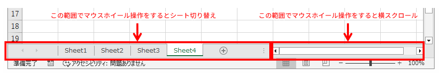
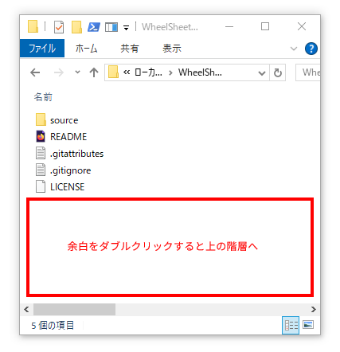
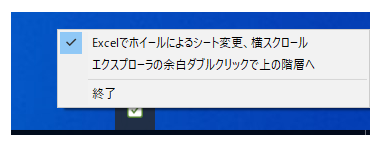

# WheelSheetChanger
 
## 概要

以下の3つの操作ができるようになります。後述の動作確認環境と異なる環境の場合は、動作しなかったり、挙動がおかしくなったりする可能性があります。  

* Excelのシートをマウスホイール操作で切り替え  
* Excelの水平スクロールバー上でのマウスホイール操作で横スクロール  
* エクスプローラの余白をダブルクリックすることで上の階層に移動  

Excel  
  

エクスプローラ  
  

## 起動、終了、設定切替
* 起動するとタスクトレイに常駐します。  
* 終了する場合はタスクトレイアイコンの右クリックメニューから「終了」を選択します。  
* タスクトレイアイコンの右クリックメニューから操作の有効・無効を切り替えできます。  
  

## 動作確認環境
Microsoft Windows10 x64 + デスクトップ版Excel2019  

## ライセンス

This software is released under the MIT License.   
詳細については、[LICENSE](./LICENSE) ファイルを参照してください。